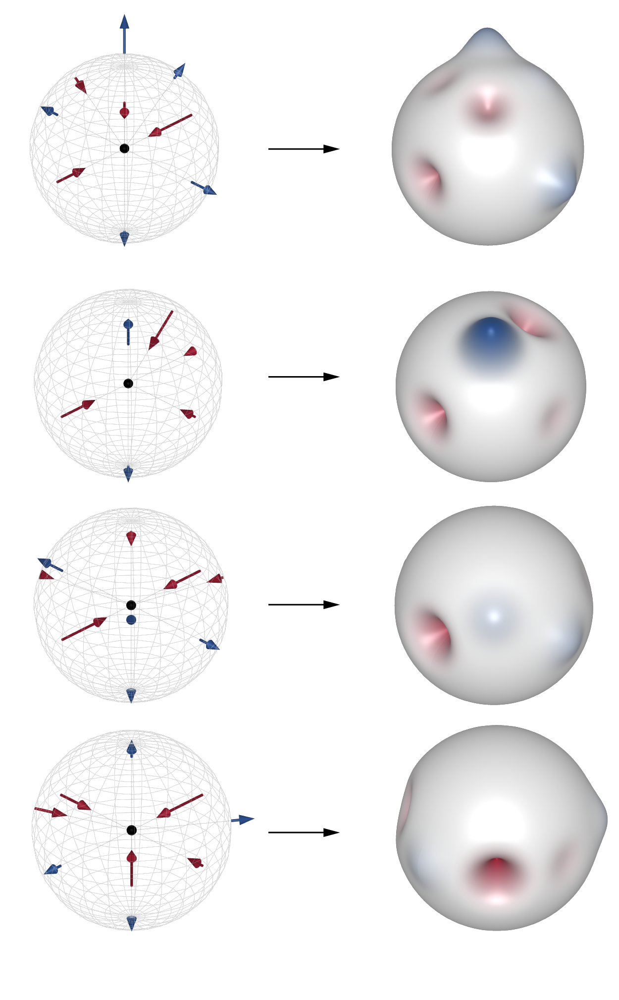

# NodeHarmonics

Public release of tools developed for forthcoming paper *Spherical harmonic shape descriptors of nodal force demands for quantifying spatial truss connection complexity*, in Architecture, Structures and Construction 2022. Stay tuned!

https://link.springer.com/article/10.1007/s44150-022-00021-4

https://arxiv.org/abs/2111.10454

